## Part1

1. Смотрим версию Ubuntu:

    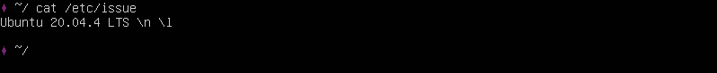

## Part2. Создание пользователя

1. Создадим нового пользователя

    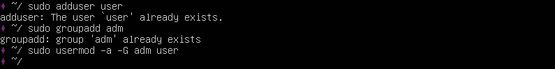

2. С помощью следующей команды добавляем пользователя user в группу adm

    `sudo usermod -a -G adm user`

3. `cat /etc/passwd` - видим нового пользователя

    

## Part3. Настройка сети ОС

1. Изменяем имя машины на user-1 с помощью команды:

    `hostnamectl set-hostname user-1`

    
    
2. Чтобы установить временную зону, соответствующую текущему местоположению, выполняем следующее:

    1) узнаем текущую временную зону:
   
        `timedatectl status`
   
    2) ищем подходящую временную зону в списке:
   
        `timedatectl list-timezones`
   
    3) устанавливаем выбранную временную зону:
   
        `timedatectl set-timezone Europe/Moscow`
        
    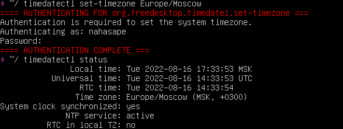

3. С помощью команды `ip address` выводим сетевые интерфейсы

    

    lo интерфейс - это реализация виртуального сетевого интерфейса, которая никак не связана с
    оборудованием, при этом полностью интегрирована в сетевую инфраструктуру компьютерной системы. Любой трафик, 
    который отправляется программой на этот интерфейс (loopback) - возвращается обратно на этот интерфейс.
    Использование данного интерфейса позволяет устанавливать соединение между программой-клиентом и 
    программой-сервером, работающей на этом же компьютере, независимо от конфигурации аппаратных систем (не нужны
    модем, сетевая карта и т.д., данный интерфейс реализуется с помощью драйвера псеводустройства в ядре операционной
    системы).

4. Dynamic Host Configuration Protocol (DHCP) - прикладной протокол, который позволяет сетевым устройствам атоматически
    получать IP-адрес и другие параметры, необходимые для работы в сети TCP/IP.

5. Чтобы получить внешний ip-адрес, отправляем запрос на сайт, который возвращает нам ip-адрес

    `curl ipconfig.org`
    
    Чтобы получить внутренний ip-адрес, выполняем команду `ip address`

6. Чтобы задать статичный ip-адрес, необходимо отредактировать файл `/etc/netplan/00-installer-config.yaml`
    следующим образом

    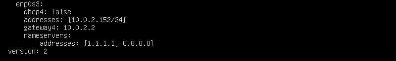

    После этого необходимо применить настройки

    `sudo netplan apply`

7. Перезагружаем машину командой `reboot`

8. Запускаем команду `ip address`, чтобы проверить статический ip-адрес

9. Ping 1.1.1.1 и ya.ru

    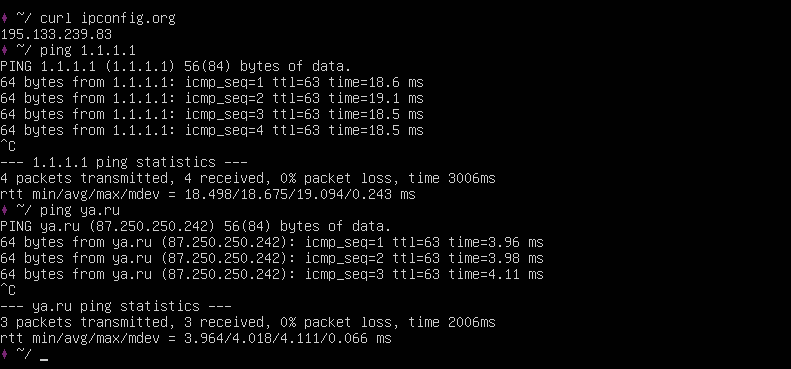

## Part 4. Обновление ОС

1. Установка обновлений выполняется с помощью команд
    
    `sudo apt update`
    
    `sudo apt upgrade`

    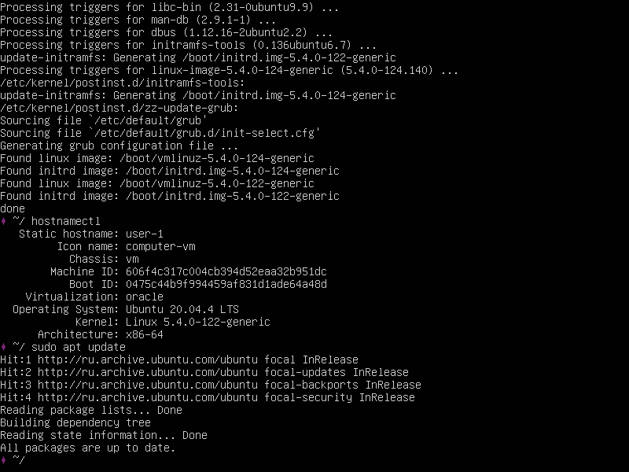

## Part 5. Использование команды sudo

1. Команда sudo позволяет выполнять команды от имени администратора, то есть такие для которых нужно специальное 
    разрешение. Это сделано для того, чтобы обезопасить от случайных "выстрелов себе в ногу". Следует аккуратно 
    обращаться с данными привилегиями, так как от этого может зависеть безопасность и целостность системы. 

2. Чтобы разрешить пользователю выполнять команду sudo, необходимо добавить его в группу sudo

    `sudo adduser user1 sudo`

3. Меняем имя машины от имени пользователя user1

    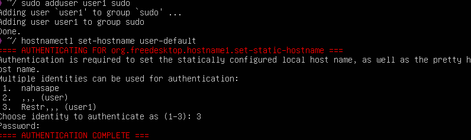

4. Новое имя машины указано в выводе команды:

    

## Part 6. Установка и настройка часового пояса

1. Узнаем текущее время, часового пояса, в котором находимся и ставим необходимый командой 
    
    `timedatectl set-timezone europe/moscow`

2. Вывод команды `timedatectl show`, в котором указано, что синхронизация настроена

    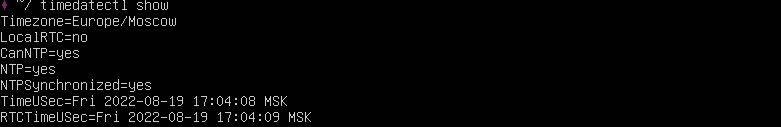

## Part 7. Установка и параметры использования текстовых редакторов

1. Так как у меня уже установлены VIM и Nano. устанавливаю еще emacs:

    `sudo apt install emacs`

2. Чтобы создать файл в emacs, открываем этот файл с помощью emacs:

    `emacs test_emacs.txt` 

3. Чтобы выйти и сохранить изменения необходимо воспользоваться сочетанием клавиш (control+x), затем (control-c),
    данная команда запросит сохранение файла перед выходом. На вопрос сохранить ли файл - отвечаем да (y).

    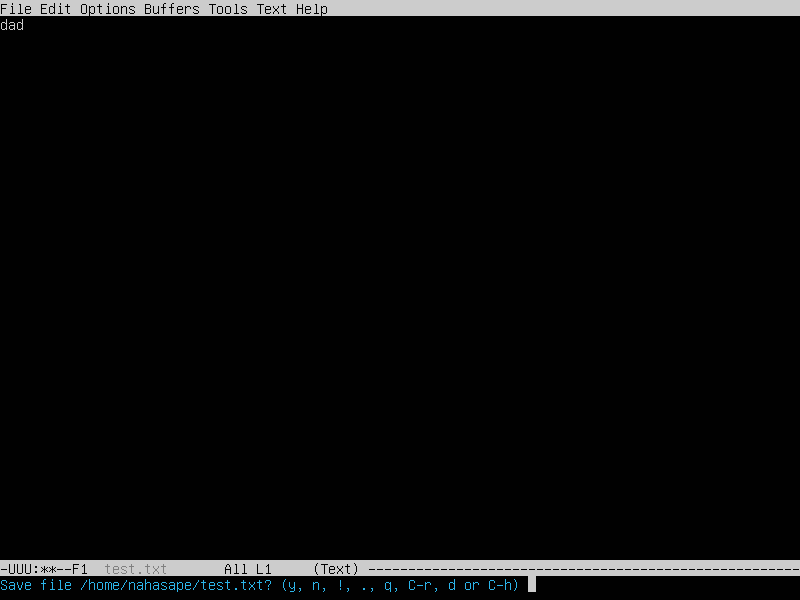

4. Также как в emacs, в vim, чтобы создать новый файл, необходимо открыть его с нужным именем:

    `vim test_vim.txt`

5. Чтобы выйти из vim и сохранить изменения, необходимо нажать `esc` ввести `:wq` 

    

6. Чтобы создать файл в nano нужно сделать тоже самое, что и в редакторах выше:

    `nano test_nano.txt`

7. В данном редакторе есть подсказки с быстрыми командами, при использовании комбинации (control+x), редактор сам
    спросит не хотим ли мы сохранить файл. Отвечаем - да (y). И тут же можем подтвердить имя файла, или записать 
    изменения в отдельный файл

    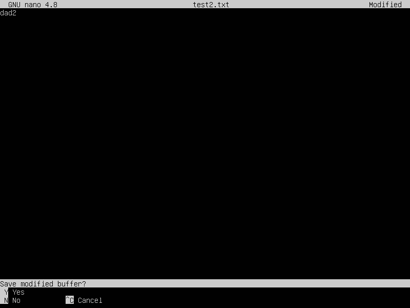

8. Чтобы отредактировать файл, нужно его открыть, выполняем это также, как и при создании файла. 

9. Чтобы выйти из vim без сохранения, необходимо нажать `esc` набрать `:q!`

    
    
10. Чтобы выйти из emacs без сохранения, можем воспользоваться тем же способом, что и при выходе с сохранением, 
    но на вопрос сохранить ли файл, отвечаем нет(no)

    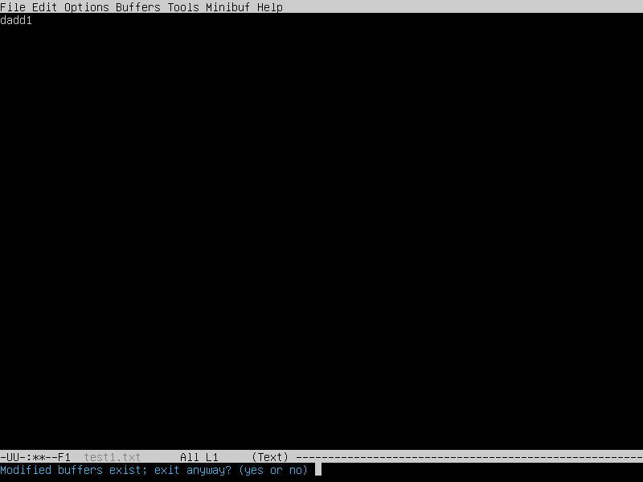

11. Чтобы выйти из nano, нужно также повторить те же действия, что и для выхода с сохранением, но на вопрос о
    сохранении ответить - нет (n)

    

12. Чтобы найти слово в vim, необходимо нажать `esc` после этого ввести `:s/<слово_которое_ищем>`, оно подсветится
 
    

13. Чтобы заменить это слово, дописываем к указанной выше команде `/<слово_на_которое_меняем>` 

    

14. Чтобы найти слово в emacs, необходимо ввести комбинацию клавиш (control+s) затем ввести слово, которое ищем

    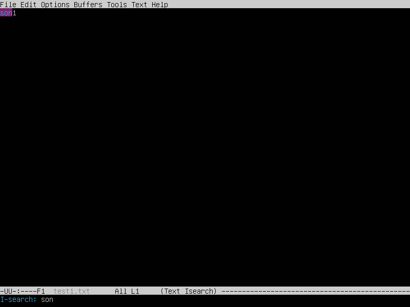

15. Чтобы заменить слово в emacs необходимо нажать сочетание клавиш (alt+x), дальше ввести `replace-string`,
    нажать `enter`, ввести заменяемое слово, ввести слово на которое меняем:

    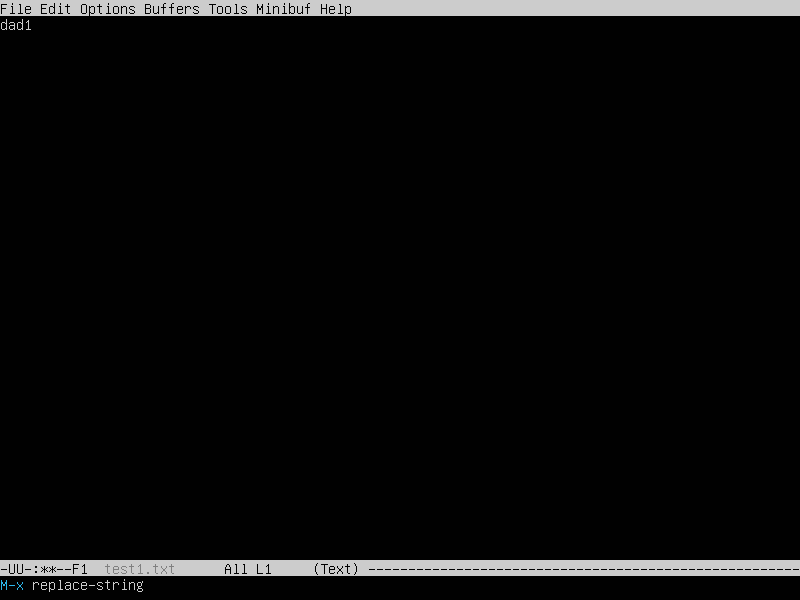

16. Чтобы найти слово в nano необходимо нажать сочетание клавиш (control+W), и ввести слово, которое ищем

    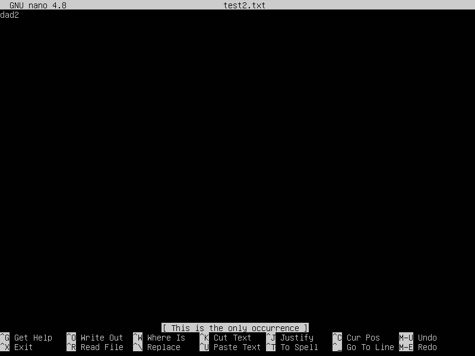

17. Чтобы заменить слово в nano, необходимо нажать сочетание клавиш (control+\) ввести слово, которое мы хотим
    заменить, нажать `enter`, после этого ввести слово, на которое мы хотим заменить и нажать `enter`

    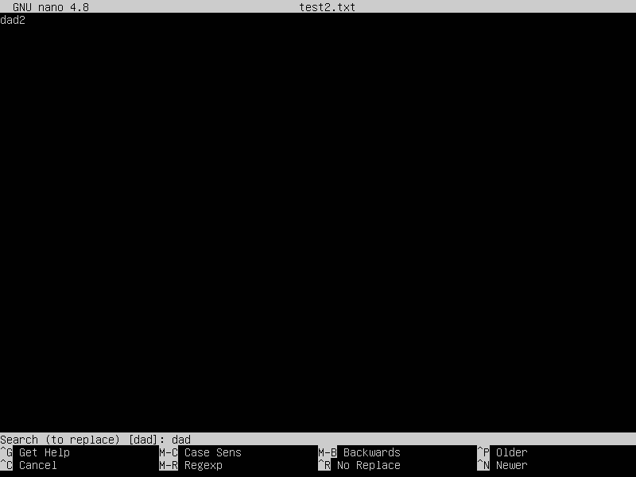

## Part 8. Установка и настройка сервиса SSHD

1. Устанавливаем OpenSSH Server

    `sudo apt install openssh-server`

2. Настраиваем автозапуск службы при загрузке системы:

    `sudo systemctl enable ssh`

3. Для изменения порта редактируем файл `/etc/ssh/sshd_config`, добавляя строчку: `Port 2022`

4. Чтобы показать наличие процесс sshd с помощью команды ps, данную команду необходимо использовать с флагом `-C`
    и названием команды `sshd`, данный флаг подразумевает вывод процесса по названию команды:

    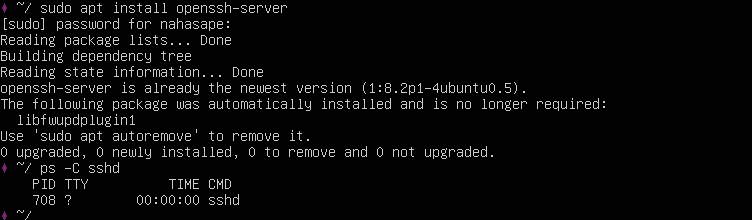

5. Перезагружаем системы командой `reboot`

6. Устанавливаем netstat:

    `sudo apt install net-tools`

7.   Запускаем команду `netstat -tan`, где флаг `-tan` подразумевает три флага:
       `-t` - отображение текущего подключения в состоянии переноса нагрузки с процессора на сетевой адаптер
       `-a` - показываем состояние всех сокетов, как правило сокеты, используемые серверными процессами не показываются,
       `-n` - просим показать сетевые адреса как числа.
       
       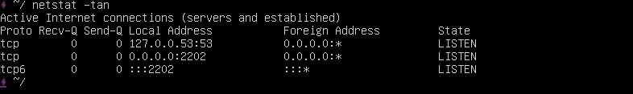
       
Колонки в выводе означают следующее:

`Proto` - Протокол, используемый сокетом

`Recv-Q` и `Send-Q` - В нашем случае (Listen) демонстрирует, что программа корректно работает с принимающей и 
отправляющей стороны (возвращает 0)

`Local Address` - Показывает локальный адрес и порт, 0.0.0.0 - означает, что служба может связываться со всеми
сетевыми интерфейсами. Он дает прослушивать и принимать соединения с любого IP-адреса

`Foreign Address` - удаленный адрес (аналог local address для второй стороны)

`State` - статус сокета. В нашем случае сокет слушает входящие соединения. Такие соединения, не включаются в
вывод без флага `-a`

## Part 9. Утилиты top и htop

1. В системе уже установлены top и htop

    По полученному выводу top:

    uptime - 7 min;
    
    количество авторизованных пользователей - 1 user;

    общая загрузка системы - 0,00

    общее количество процессов - 97

    загрузка cpu - 0,0(0,3)

    загрузка памяти - 3932 MiB

    pid процесса, занимающего больше всего памяти - systemd

    pid процесса, занимающего больше всего процессорного времени - top

2. Вывод htop, отсортированный по PID

    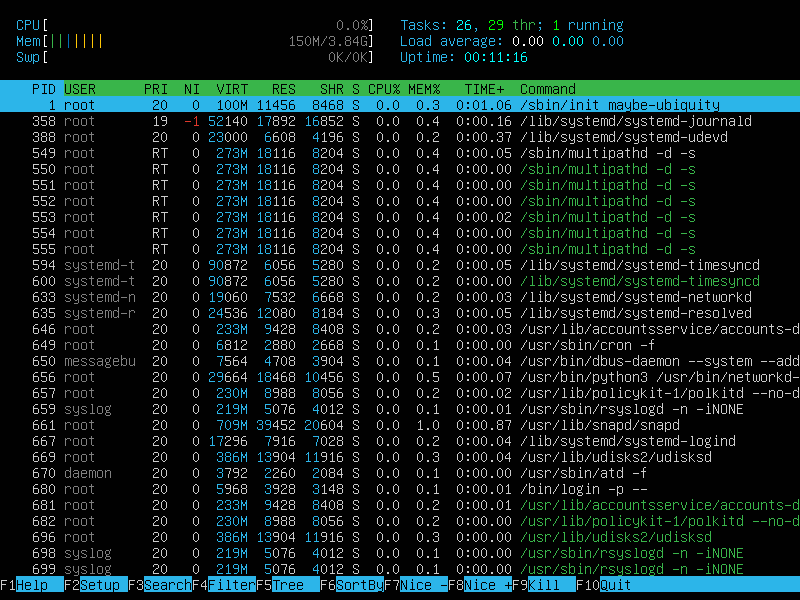

3. Вывод htop, отсортированный по PERCENT_CPU

    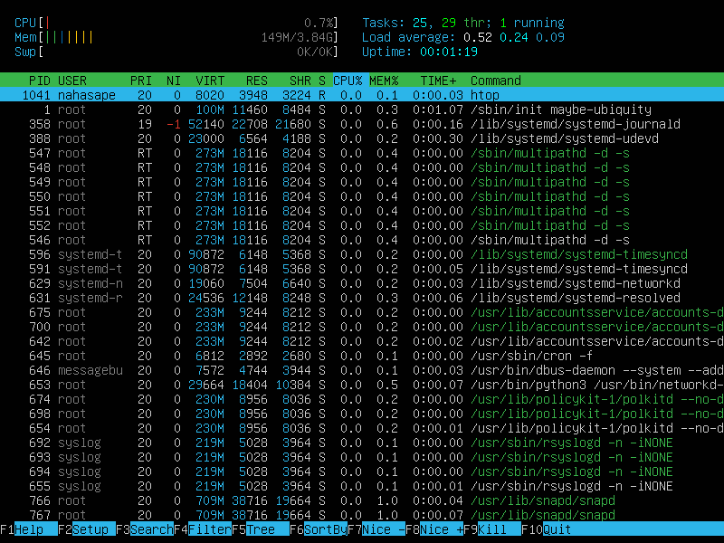

4. Вывод htop, отсортированные по PERCENT_MEM

    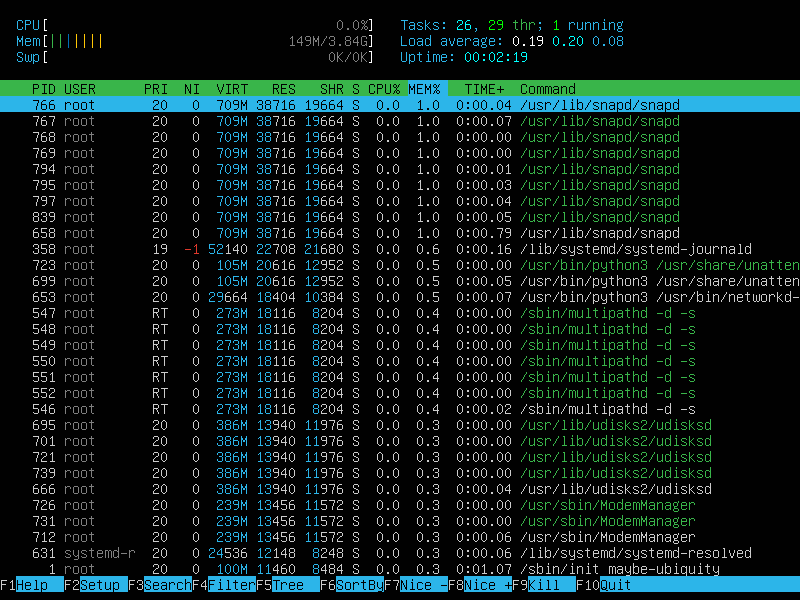

5. Вывод htop, отсортированный по TIME

    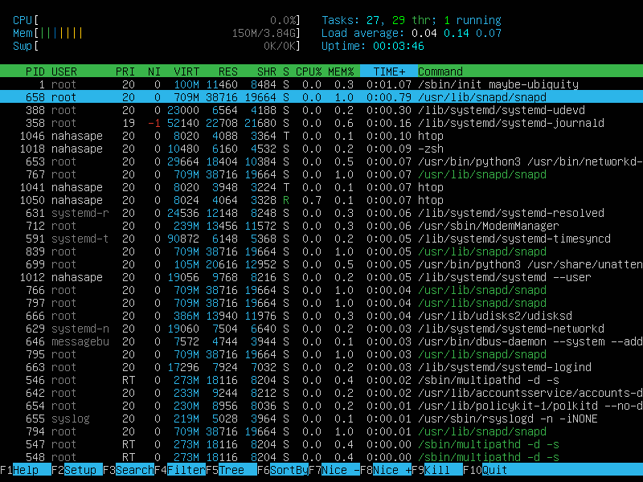

6. Вывод htop, отфильтрованый по процессу sshd

    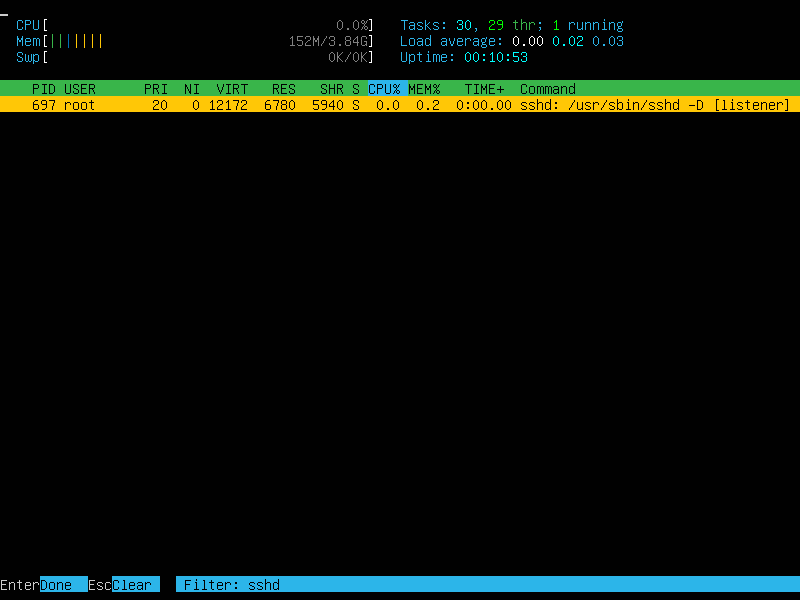

7. Вывод htop с процессом syslog, найденным, использую поиск

    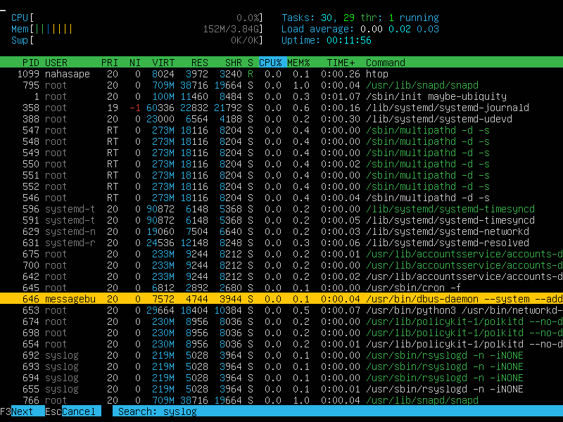

8. Вывод htop с добавленным выводом hostname, clock и uptime

    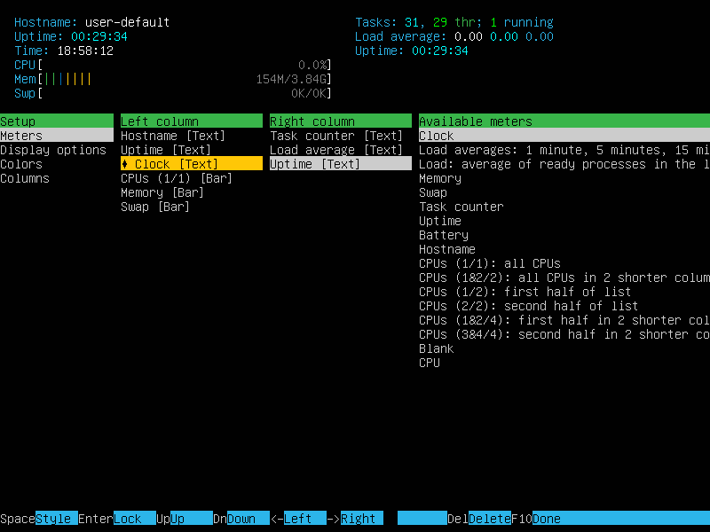

## Part 10. Утилита fdisk

1. Название жесткого диска - /dev/sda

2. Размер жесткого диска - 10 GiB

3. Количество секторов - 20971520

4. Размер swap - 0

## Part 11. Утилита df

1. Для корневого раздела с утилитой df:

    1) Размер раздела - 9299276

    2) Размер занятого пространства - 4516216

    3) Размер свободного пространства - 4289084

    4) Процент использования - 52%

2. Для корневого раздела с утилитой df и флагом -Th:

    1) Размер раздела - 8,9G

    2) Размер занятого пространства - 4,4G

    3) Размер свободного пространства - 4,1G

    4) Процент использования - 52%

3. Тип файловой системы ext4

## Part 12. Утилита du

1. Вывод команды du

    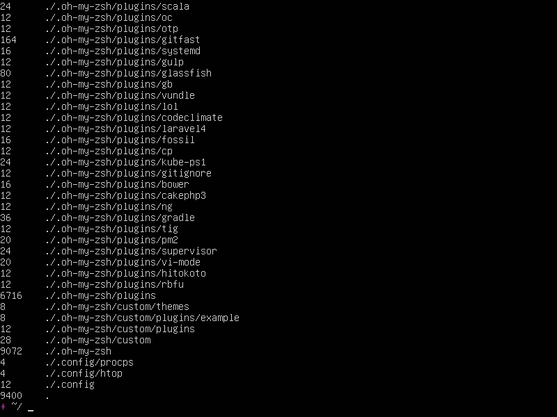

2. Вывод команды du c флагами:

    `-b` - для вывода в байтах

    `-h` - для вывода в человекочитаемом виде

    `-s` - для суммарного вывода по директории

    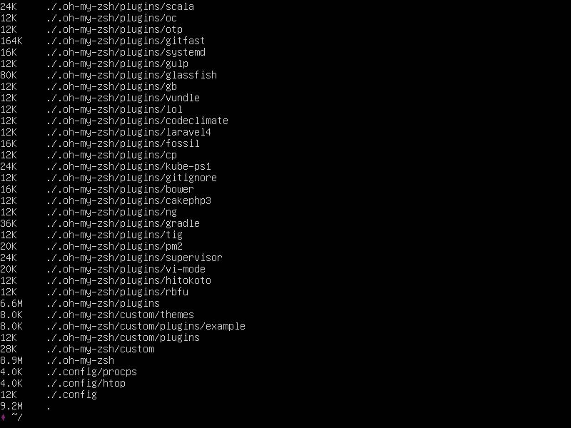

3. Вывод размера всего содержимого в `/var/log` с помощью команды

    `sudo du -b -h /var/log/*`

    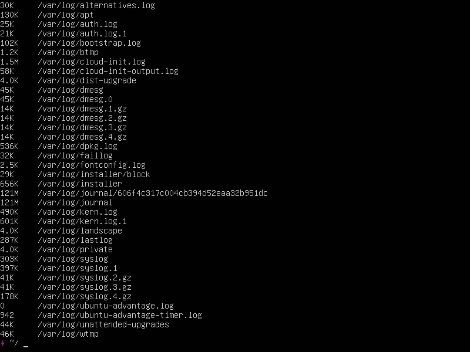

## Part 13. Установка утилиты ncdu

1. Устанавливаем утилиту ncdu:

    `sudo apt install ncdu`

2. Вывод размера /var/log командой `ncdu /var/log`

   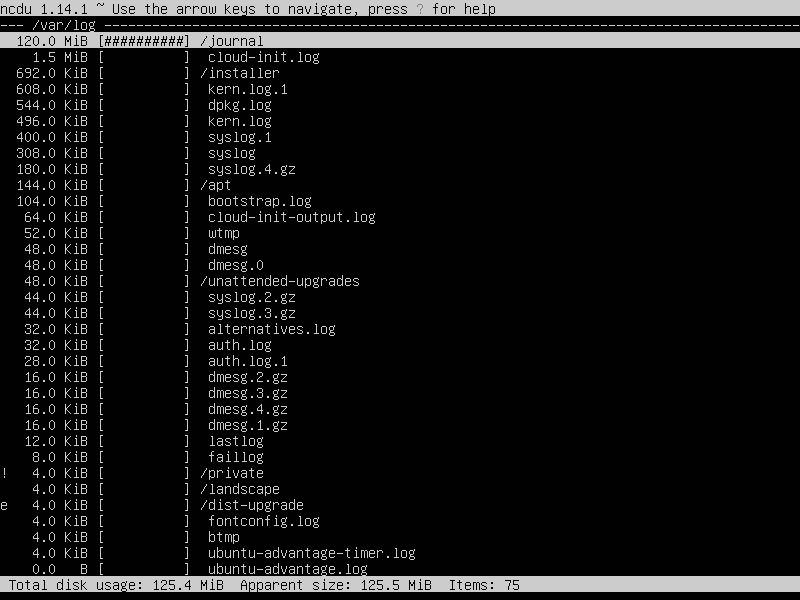

3. вывод размера /var командой `ncdu /var`

    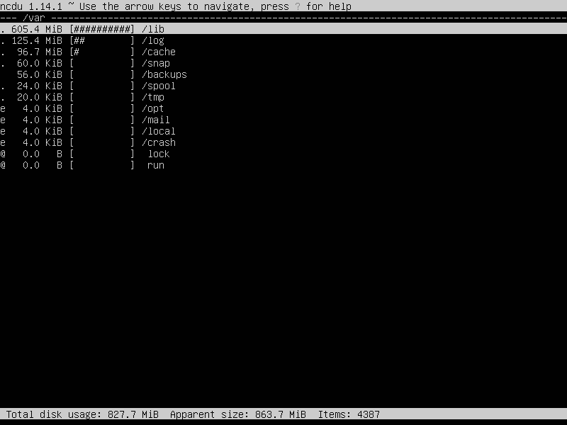

4. Вывод размера /home командой `ncdu /home`

    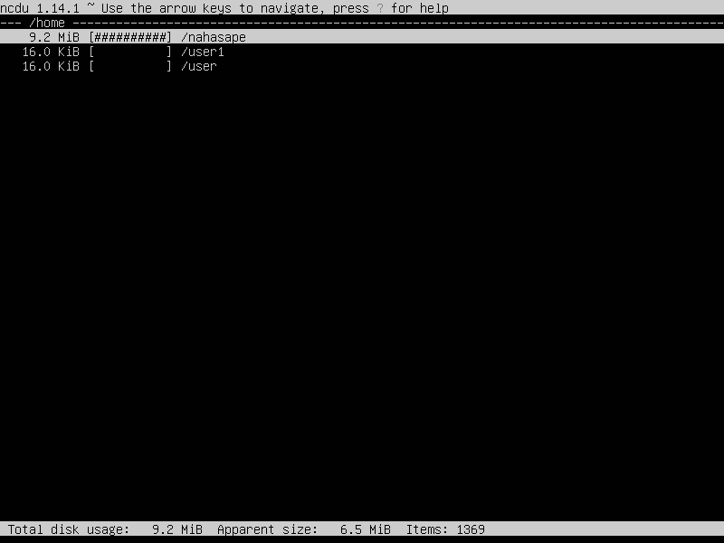

## Part 14. Системные журналы

1. Время последней успешной авторизации - 19 августа 19:45:10

2. Имя пользователя - user

3. Метод входа в систему (login:session)

4. Сообщение о перезапуске SSHd

    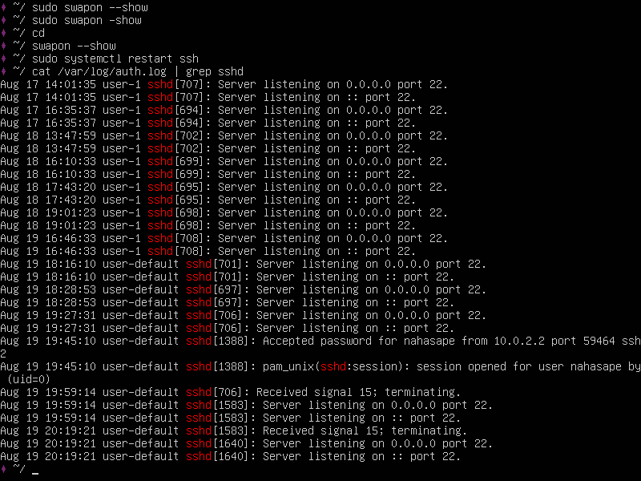

## Part 15. Использование CRON

1. Запуск команды uptime каждые две минуты:

    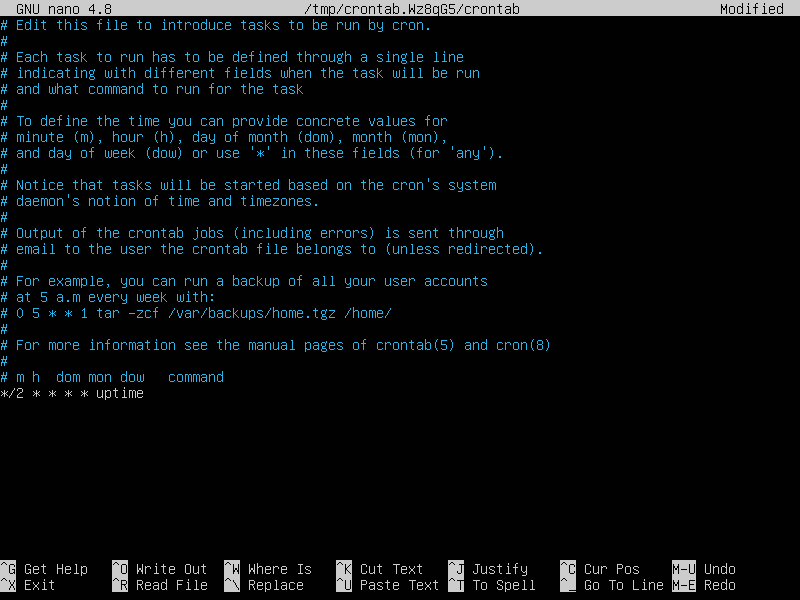

2. Просмотр текущих заданий для cron

    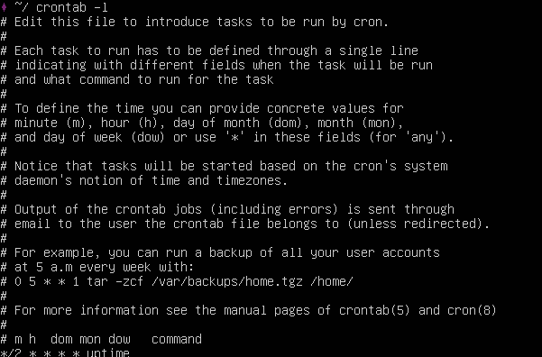

3. Просмотр текущих задач после удаления задач из планировщика

    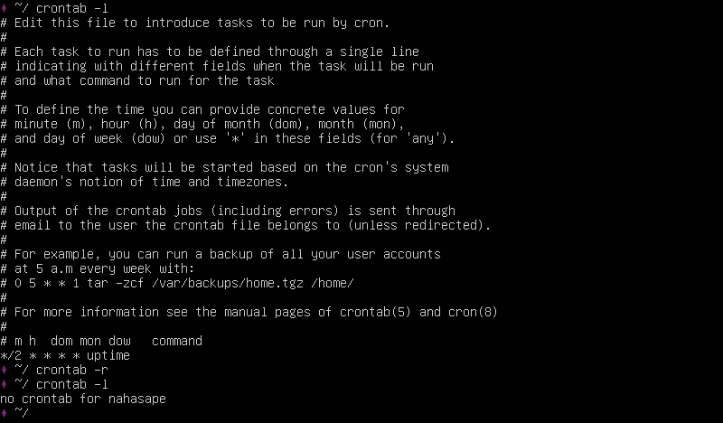
